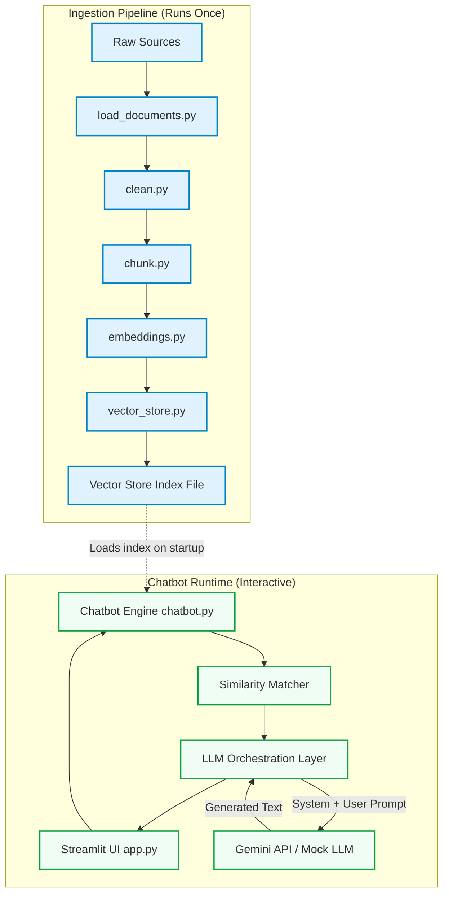
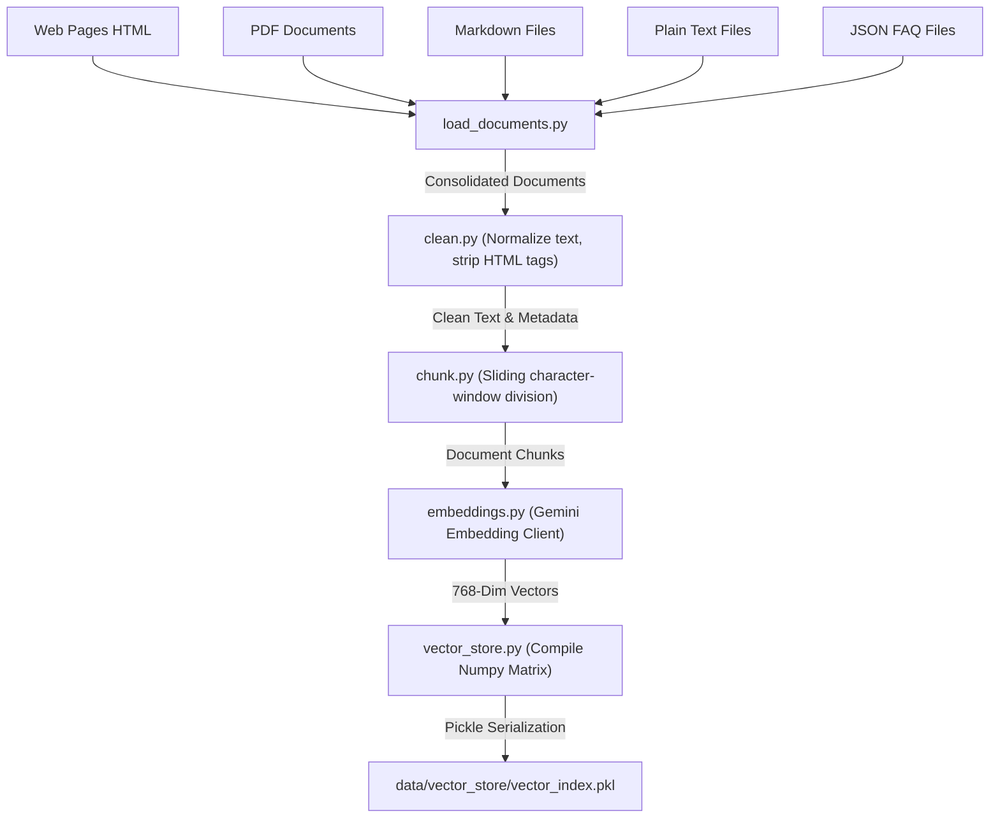
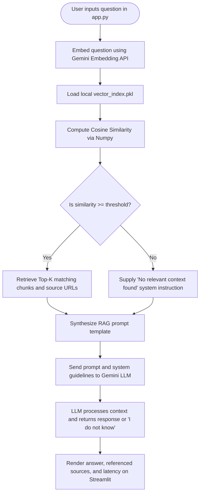
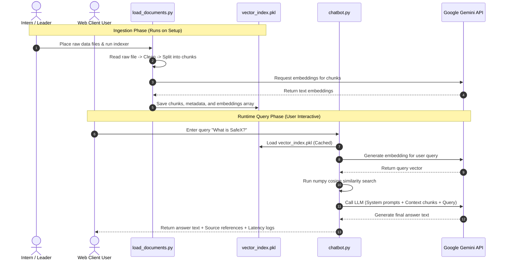

# System Architecture - SafeX AI Knowledge Assistant (RAG)

This document describes the design, architecture, and data flow of the Retrieval-Augmented Generation (RAG) assistant for SafeX Solutions.

---

## 1. Overall System Architecture

The SafeX AI Knowledge Assistant is split into two distinct operational environments:
1. **The Ingestion Pipeline (Offline/Batch)**: Loads, cleans, chunks, embeds, and saves document indexes into a file-based vector store.
2. **The Chatbot Runtime (Online/Interactive)**: Loads the saved index, accepts user questions, retrieves the most relevant content chunks, and queries Google's Gemini API to generate accurate answers.

---

## 2. Document Ingestion Pipeline Flow

The ingestion pipeline converts raw source files of multiple formats into mathematical vector embeddings, storing them alongside their textual content and metadata.

---

## 3. Runtime Query Flow

When a user submits a question through the Streamlit web interface, the runtime performs real-time retrieval and generation to formulate an answer.

---

## 4. End-to-End Data Flow Matrix

This flowchart maps how data flows from its raw ingestion format down to its representation in the user's interface.

