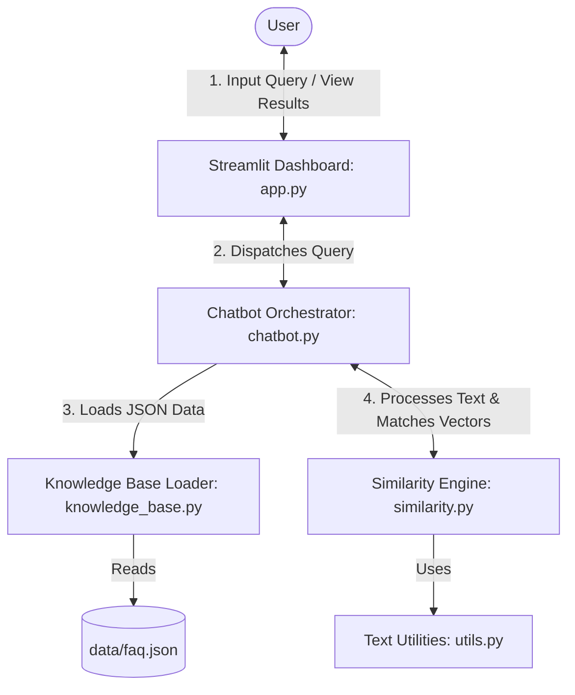
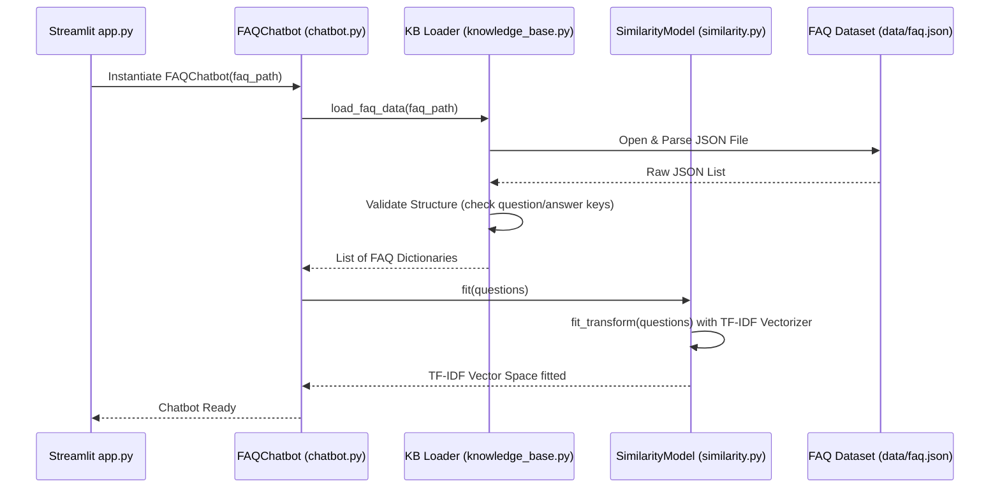
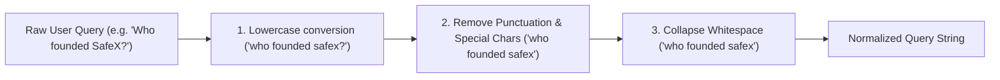
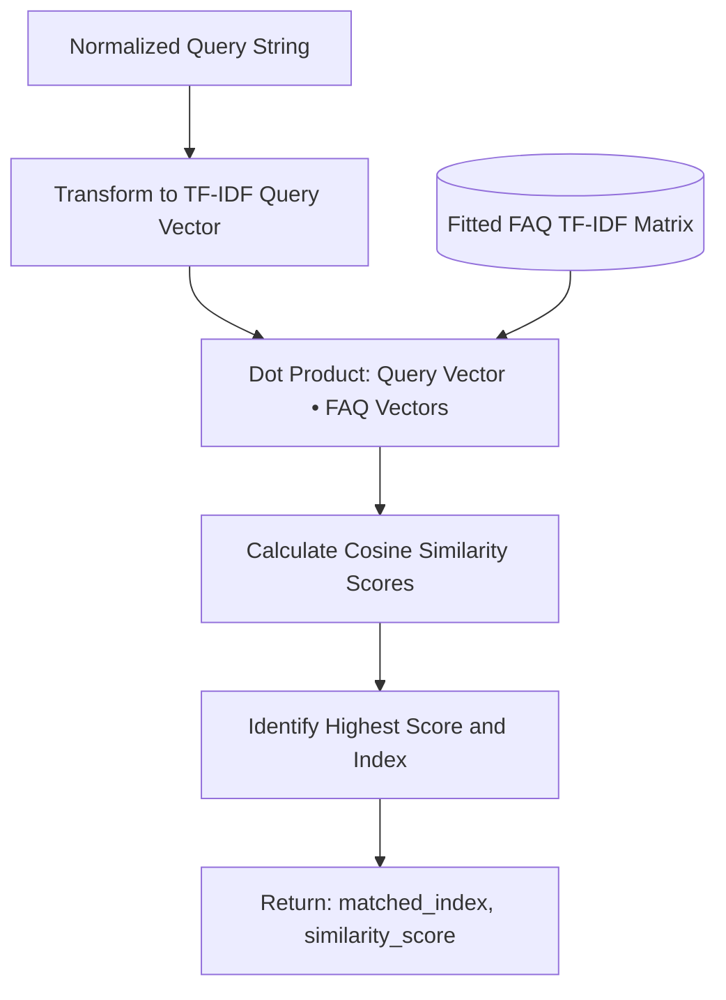
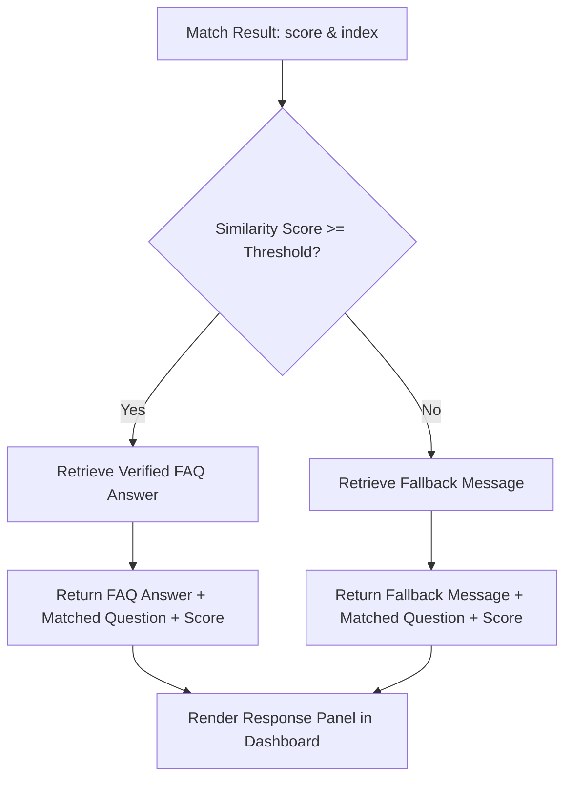

# safex-ai-faq-chatbot — System Architecture

This document outlines the system architecture and data-flow pipelines for the SafeX Semantic FAQ Chatbot. The design follows strict modular guidelines where each component carries exactly one responsibility.

---

## 1. Overall System Architecture

The system uses a classic decoupled Model-View-Controller (MVC) architectural design, where:
- **View:** The Streamlit dashboard (`app.py`) provides the interface for user input and visualizes similarity analytics.
- **Controller/Orchestrator:** The `FAQChatbot` class (`chatbot.py`) coordinates loading the database and dispatching similarity matching.
- **Model/Engine:** The similarity module (`similarity.py`) holds the TF-IDF and cosine similarity logic, utilizing `scikit-learn`.

---

## 2. Knowledge Base Loading Flow

This sequence occurs once during the initialization of the chatbot, fitting the vectorizer on the verified FAQ dataset:

---

## 3. Question Processing Pipeline

Every user query undergoes normalization before calculation to ensure matches are spelling-case and punctuation independent:

---

## 4. Similarity Matching Engine

The core similarity algorithm uses a local Vector Space Model. We compute the Cosine Similarity between the normalized user query vector and all FAQ question vectors:

Cosine Similarity is calculated as:
$$\text{Similarity}(\mathbf{q}, \mathbf{d}) = \cos(\theta) = \frac{\mathbf{q} \cdot \mathbf{d}}{\|\mathbf{q}\| \|\mathbf{d}\|} = \frac{\sum_{i=1}^{n} q_i d_i}{\sqrt{\sum_{i=1}^{n} q_i^2} \sqrt{\sum_{i=1}^{n} d_i^2}}$$

---

## 5. Response Generation & Threshold Logic

Once a match is returned, the orchestrator evaluates whether the similarity score exceeds the configured minimum threshold before returning the answer:

