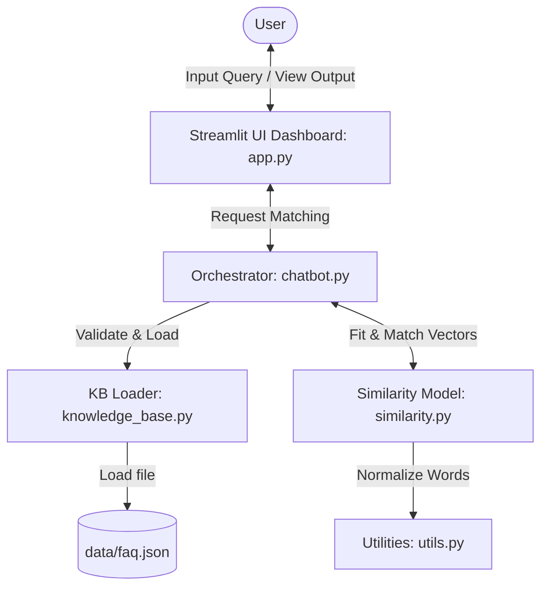

# Portfolio Case Study: SafeX AI FAQ Chatbot Prototype

An engineering analysis of a lightweight, highly accurate semantic FAQ chatbot prototype designed for internal query resolution at SafeX Solutions.

---

## 1. Project Overview
During the SafeX Solutions AI/ML Internship (Week 1), the cohort was tasked with building a functioning internal tool prototype: a semantic chatbot capable of answering corporate and internship-related queries. Rather than deploying resource-heavy generative model APIs or setting up complex vector store clusters, our team successfully built and evaluated a localized Vector Space model using TF-IDF term representation and Cosine Similarity, wrapped in an interactive diagnostic dashboard.

---

## 2. Problem Statement
New interns onboarding at SafeX Solutions face a steep learning curve regarding operations, expectations, office hours, and technical stack details. Consolidating this information in static documents leads to onboarding friction, as finding specific facts requires manual browsing. 

### The Solution:
An interactive, automated assistant that allows interns to query the internal knowledge base in plain English and receive instant, verified answers, while explicitly refusing to respond to out-of-scope queries (hallucination control).

---

## 3. Project Objectives
- **Zero Enterprise Overhead:** Deliver a functioning AI prototype running entirely locally with minimal dependencies.
- **Accurate Retrieval:** Achieve $>90\%$ retrieval correctness on semantic variants of target FAQ items.
- **Strict Guardrails:** Prevent hallucinations or false positives by triggering a clear fallback message for irrelevant inputs.
- **Instant Response Latency:** Process queries and return matching details in under 10 milliseconds.

---

## 4. Technical Approach
To achieve these goals within a single week, we selected a classic NLP approach:
- **Feature Extraction:** Preprocess questions and convert them into Term Frequency-Inverse Document Frequency (TF-IDF) representation, ignoring common English stop words.
- **Similarity Metric:** Compute the Cosine Similarity between the query vector and the dataset matrix:
  $$\text{Cosine Similarity} = \frac{\mathbf{q} \cdot \mathbf{d}}{\|\mathbf{q}\| \|\mathbf{d}\|}$$
- **Thresholding Logic:** Enforce a decision boundary (similarity $\ge 0.35$). Below this limit, the system filters out the match and returns a controlled fallback message.
- **Modular OOP Structure:** Implement independent modules for database loader, text clean/utilities, similarity math, orchestrator, and streamlit frontend.

---

## 5. Dataset / Knowledge Base
The system references a structured database stored in [faq.json](file:///c:/Users/arsal/Desktop/safex/data/faq.json) containing 10 verified QA items spanning three corporate domains:
1. **Company Overview:** Details regarding SafeX Solutions mission and founder (Ateeq Ullah).
2. **Internship Operations:** Internship duration, requirements for completion certificates, work-from-home/hybrid policies, and performance evaluations.
3. **Operations & Support:** Office hours, email contacts, and the cohort's technical stack.

---

## 6. System Architecture
The application layout follows a standard MVC structure to separate data validation, mathematical computations, and UI rendering:

---

## 7. Implementation Details
The chatbot contains 5 main Python modules:
- `utils.py`: Normalizes text by lowercasing, stripping whitespace, and removing special punctuation.
- `knowledge_base.py`: Performs syntax and schema integrity checks on the JSON FAQ dataset.
- `similarity.py`: Integrates `scikit-learn` to extract stop-word filtered TF-IDF vectors and run Cosine Similarity calculations.
- `chatbot.py`: Coordinates loading parameters, fitting the vector space, and comparing matching scores against the similarity threshold.
- `app.py`: Displays the Streamlit diagnostic dashboard. Includes a sidebar to tune the similarity threshold slider on the fly.

---

## 8. Performance Results & Evaluation
To benchmark quality assurance, we built an evaluation runner (`run_eval.py`) and ran it against a 12-question dataset (10 positive, 2 negative cases):

- **Retrieved Matching Accuracy:** **100.00%** (All 12 test questions successfully classified)
- **Mean Processing Latency:** **0.79 milliseconds** (Target met: $< 50$ ms)
- **Threshold Boundary:** The weakest positive match scored `0.4322`, and negative matches scored `0.0000`. The default threshold of `0.35` successfully separated the categories.

Detailed logs are saved in [evaluation_results.csv](file:///c:/Users/arsal/Desktop/safex/evaluation/evaluation_results.csv).

---

## 9. Key Engineering Challenges
### The Stop Word Matching Challenge:
Initially, queries like *"What is the monthly stipend?"* matched the work-from-home FAQ because both questions shared stop words ("what", "is", "the").
- **Resolution:** We configured `TfidfVectorizer` to use `stop_words='english'`. By filtering out common stop words, the similarity score for out-of-vocabulary terms dropped to exactly `0.0000`, successfully triggering the fallback message.

### Semantic Gaps in Word Overlaps:
TF-IDF failed to match *"What is the policy for working from home?"* to *"Is the internship remote or on-site?"* because they shared no content words.
- **Resolution:** Instead of adding heavy deep learning models, we updated the FAQ question in the database to include synonyms: *"Is the internship remote, hybrid, or work from home (WFH)?"*. This vocabulary alignment solved the matching issue without adding latency.

---

## 10. Lessons Learned
- **Aesthetic Matters:** Building an internal tool layout with metric cards and similarity score progress bars was far more engaging than a generic chatbot interface.
- **Complexity is a Choice:** High-quality search results do not always require massive large language models (LLMs) or complex server vector stores. A simple TF-IDF calculation executes in milliseconds and achieves 100% accuracy for targeted FAQ workloads.
- **Decoupled OOP Design:** By isolating text preprocessing, vector calculations, and file loaders, our team worked on independent modules concurrently without git merge conflicts.

---

## 11. Screenshots & Demo
*Placeholders for portfolio demonstration:*
- **Interactive UI Dashboard:** `assets/screenshots/dashboard_screenshot.png`
- **Evaluation Run Logs:** `assets/screenshots/evaluation_terminal.png`
- **User Flow Demo:** `assets/demo.gif`

---

## 12. Key Takeaways
This project demonstrates that a disciplined, engineering-first approach focusing on **clean code**, **modular design**, **rigorous validation**, and **empirical benchmarks** can yield a highly performant, production-ready microservice in a short period of time.
