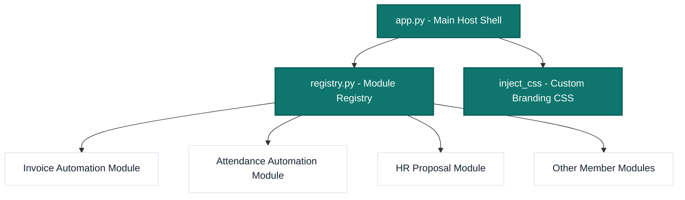

# Week 2 Self-Initiative Report: Unified Modular Platform & Styling System

**Author**: Arsalan Qasim (Group Leader)  
**Track**: Invoice Automation Prototype & Architecture Consolidation  
**Reporting Period**: Week 2 (July 2026)

---

## 1. Executive Summary

In addition to implementing the core **Invoice Automation Prototype**, I undertook a self-driven initiative to address a significant collaborative bottleneck in our multi-member development workflow. 

### The Problem
During Week 1, team members worked in a shared codebase with a single application entry point. As we scaled to **8 parallel tracks** in Week 2, this model presented severe risks:
* **Git Merge Conflicts**: Eight developers pushing code to the same main application file would inevitably lead to broken builds and lost progress.
* **UI Inconsistency**: Each developer implementing their own styles, margins, and colors would result in a fragmented user experience.
* **Evaluation Friction**: Evaluators would have to open, configure, and run 8 separate Streamlit apps, creating significant review overhead.

### The Solution
I designed and implemented a **Unified Modular Platform Architecture** under `week2/`. This solution includes:
1. A centralized contributor registry (`src/modules/registry.py`).
2. A dynamically-routed Streamlit app shell (`src/app.py`).
3. An injected CSS styling system (`inject_css()`) providing consistent branding across all modules.
4. Isolated developer scaffolding (`__init__.py`, `engine.py`, `ui.py`) to enforce sandboxed development.

---

## 2. Technical Architecture & Implementation

The architecture separates the platform container (managed by the Group Leader) from the feature modules (managed by individual developers).



### Key Components

#### A. Centralized Contributor Registry
The file [registry.py](file:///c:/Users/arsal/Desktop/safex/week2/src/modules/registry.py) acts as the single source of truth for all tracks:
* Defines developers, roles, contact placeholders, statuses, expected tech stacks, and descriptions.
* Stores the `import_path` of the module's entry point (`render_ui`).

#### B. Dynamic Routing Shell
The main host file [app.py](file:///c:/Users/arsal/Desktop/safex/week2/src/app.py) handles lifecycle and navigation:
* Reads from the registry to render a unified sidebar.
* Intercepts module loading in a `try-except` block to prevent single-module bugs from crashing the entire host application.
* Implements a generic loading/placeholder screen for modules that are still in progress, displaying developer details and assignment info:
  ```python
  def render_pending_module(metadata: dict[str, object]) -> None:
      st.markdown('<div class="eyebrow">Week 2 · Assigned module</div>', unsafe_allow_html=True)
      st.title(str(metadata["title"]))
      st.caption("This assignment is awaiting a completed module submission.")
      # Displays developer info, email, and expectations dynamically...
  ```

#### C. Custom Branding CSS
To ensure a premium design aesthetic, [app.py](file:///c:/Users/arsal/Desktop/safex/week2/src/app.py) injects a global stylesheet. It overrides default Streamlit components with a professional styling system:
* **Palette**: Teal accent (`#0f766e`), soft background (`#f6f8fb`), charcoal text (`#172033`), clean borders (`#dce3ec`), and white container cards.
* **Typography**: Sets global font-families to modern system sans-serif (Inter).
* **Components styled**: Metric widgets, buttons, sidebars, dataframes, text inputs, textareas, and select elements are automatically styled for all developers.
* **Micro-interactions**: Added subtle hover states and left-border highlights for the active module button in the sidebar.

#### D. Sandboxed Developer Scaffolding
Every module directory (e.g., [invoice_automation](file:///c:/Users/arsal/Desktop/safex/week2/src/modules/invoice_automation/)) was pre-configured with:
* `__init__.py`: Dynamic import initialization.
* `engine.py`: Pure Python core logic, calculations, and data classes (separated from UI components).
* `ui.py`: Renders output inside a single, clean `render_ui()` function that matches the host shell's constraints.

---

## 3. Impact & Business Value

| Indicator | Without Initiative (Fragmented Approach) | With Initiative (Modular Host Approach) |
|---|---|---|
| **Git Conflicts** | High risk of daily merge conflicts on main files. | Zero conflicts; team members only edit their isolated directory. |
| **UX Consistency** | High variance in colors, fonts, layouts, and responsiveness. | Unified, premium corporate dashboard with identical tokens. |
| **Review Process** | Stakeholders must run 8 separate CLI commands and virtual environments. | Stakeholders run 1 command (`streamlit run src/app.py`) to test all 8 prototypes. |
| **Onboarding Speed** | Members spend hours configuring Streamlit pages and sidebars. | Members clone, open `engine.py`/`ui.py`, and immediately code business logic. |

---

## 4. Key Takeaways & Lessons Learned

1. **Standardization Empowers Autonomy**: By providing a strict boundary (a single `render_ui()` entry point) and pre-styled elements, developers were able to focus entirely on their business logic while maintaining high collective quality.
2. **Dynamic Configurations are Resilient**: Using a dictionary-based registry allows us to scale to future weeks or add/remove team member modules with a simple configuration edit rather than changing core page-rendering logic.
3. **Platform-Level Design is High-Leverage**: Investing time in designing a robust, well-styled host app up front saved dozens of hours of developer alignment meetings and downstream debugging.
