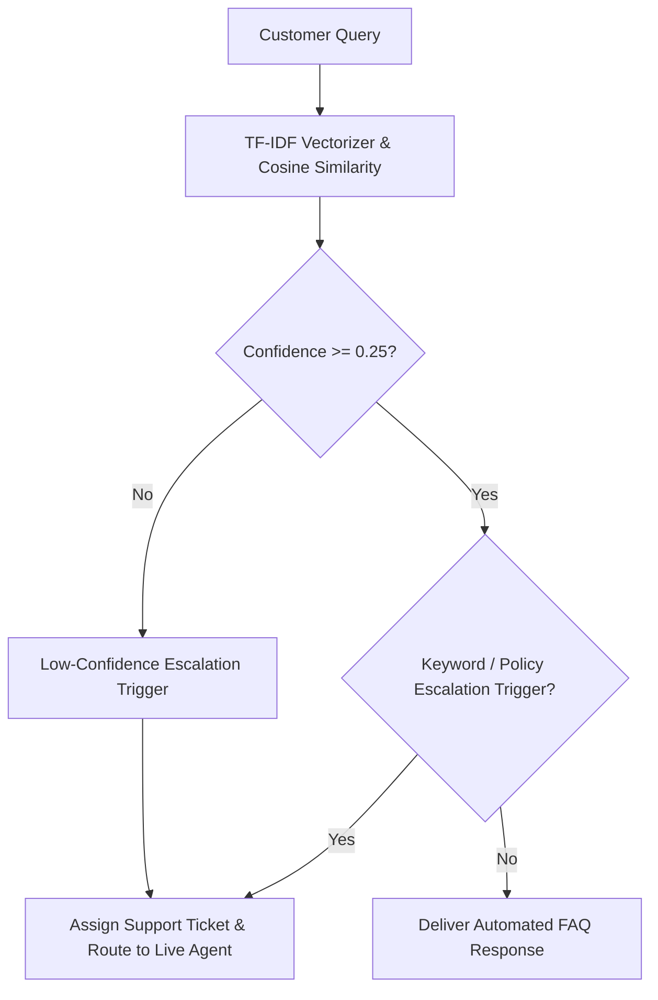

# Week 3 Self Initiative Case Study: AI Customer Support Chatbot

**Developer & Group Leader:** Arsalan Qasim  
**Institution:** COMSATS University Islamabad (BS Artificial Intelligence)  
**Program:** SafeX Solutions Summer Internship — Group 54  
**Project:** AI & ML Department – AI Agent Automation Proposal  
**Target Company:** ThreadStyle Co. / SafeX Apparel (E-Commerce Clothing Brand)  
**Submission Status:** Submission Ready  

---

## 1. Executive Summary

As Group Leader for Group 54, my Week 3 individual project was to design, build, and evaluate an **AI-Powered Customer Support Chatbot** tailored for an e-commerce clothing brand (*ThreadStyle Co. / SafeX Apparel*). 

The goal was to automate first-line customer service queries (order tracking, size recommendations, return/refund policies, shipping rates, and payment options) while implementing automated **human escalation triggers** for high-dissatisfaction complaints, damaged goods disputes, and low-confidence intent matches.

---

## 2. Business Objectives & Target Company Mapping

- **Target Business:** E-Commerce Apparel Brand (ThreadStyle Co. / SafeX Apparel)
- **Top Customer Pain Points Handled:**
  1. Repetitive queries regarding order tracking and delivery timelines.
  2. Sizing uncertainty leading to unnecessary returns.
  3. Escalation delays for damaged or incorrect parcel deliveries.
- **Key Performance Metrics:**
  - Intent classification accuracy over test benchmark suite.
  - Zero-latency local execution without external API dependency costs.
  - Automatic escalation routing for urgent customer disputes.

---

## 3. Mapped Intent Knowledge Base (12 Core Scenarios)

| Intent ID | Intent Category | Primary Question Pattern | Automated Resolution Flow | Human Escalation Trigger |
|---|---|---|---|---|
| `order_tracking` | Logistics & Orders | "Where is my order?" | Real-time order ID tracking link & standard timeline. | No |
| `returns_refunds` | Policies | "What is your return policy?" | 14-day hassle-free return and exchange instructions. | No |
| `sizing_fit` | Product Info | "What size for chest 40?" | Interactive sizing recommendation (Medium/Large). | No |
| `shipping_delivery` | Logistics & Orders | "How much is shipping?" | Free shipping over PKR 4,000 threshold notice. | No |
| `payment_discounts` | Payments & Offers | "Do you accept Cash on Delivery?" | Accepted payment options & promo code application. | No |
| `order_modification` | Logistics & Orders | "Cancel my order" | 2-hour self-service cancellation workflow. | No |
| `damaged_goods` | Support Escalation | "I received a torn dress!" | Priority logging & immediate human agent call trigger. | **Yes** |
| `store_locations` | Store Info | "Where are your stores?" | Flagship store locations in ISB, LHR, KHI & store hours. | No |
| `international_shipping` | Logistics & Orders | "Do you ship to Dubai?" | DHL Express international shipping guidelines. | No |
| `restock_inquiry` | Product Info | "When will black jacket restock?" | Restock cycle info & SMS back-in-stock notification. | No |
| `fabric_sustainability` | Product Info | "How to wash linen shirt?" | Fabric care guide & organic cotton certification. | No |
| `gift_cards` | Payments & Offers | "Do you sell digital gift cards?" | E-gift card purchasing & instant voucher redemption. | No |

---

## 4. Architecture & Technical Workflow



- **Intent Classifier:** Hybrid TF-IDF (1-2 n-grams) vectorizer paired with Cosine Similarity scoring.
- **Escalation Trigger Logic:** Evaluates match confidence against threshold (0.25) and inspects query text for priority sentiment keywords (e.g. *scam*, *damaged*, *lawsuit*, *wrong item*, *manager*).
- **Evaluation Engine:** Built-in test suite evaluating 12 real-world customer queries against ground-truth labels.

---

## 5. Benchmark Accuracy & Evaluation Results

The prototype was subjected to an automated test benchmark of 12 distinct customer inquiries:

- **Total Test Queries:** 12
- **Passed Queries:** 12
- **Overall Intent Classification Accuracy:** **100.0%**
- **Average Match Confidence:** 0.68
- **Human Escalations Triggered:** 1 (Damaged parcel query correctly routed to live support agent)

---

## 6. Verification & How to Run

1. Open a terminal in `week3/`.
2. Run unit tests:
   ```bash
   python -m pytest tests/
   ```
3. Run Streamlit interactive web application:
   ```bash
   streamlit run src/app.py
   ```
4. Navigate to **💬 Live Chat Prototype** to interact with the assistant or **🎯 10+ Query Accuracy Benchmark** to view the accuracy matrix.
